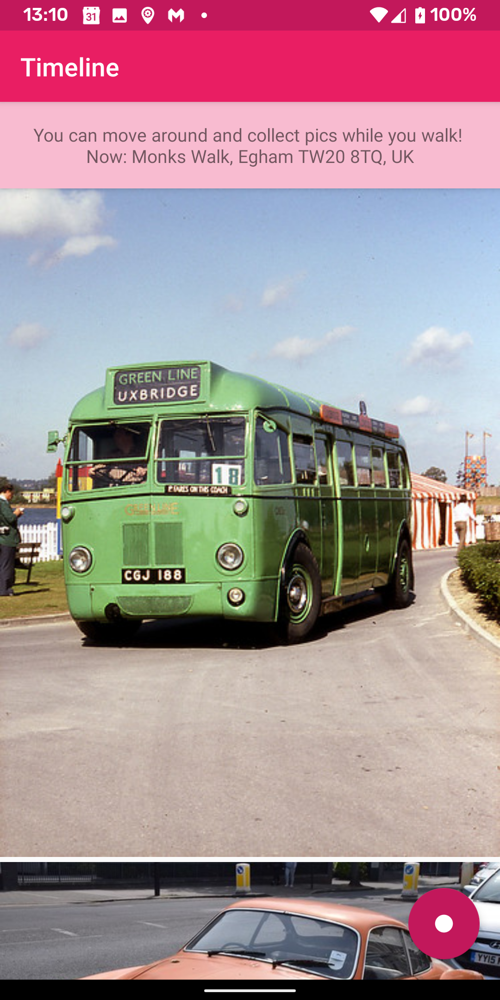
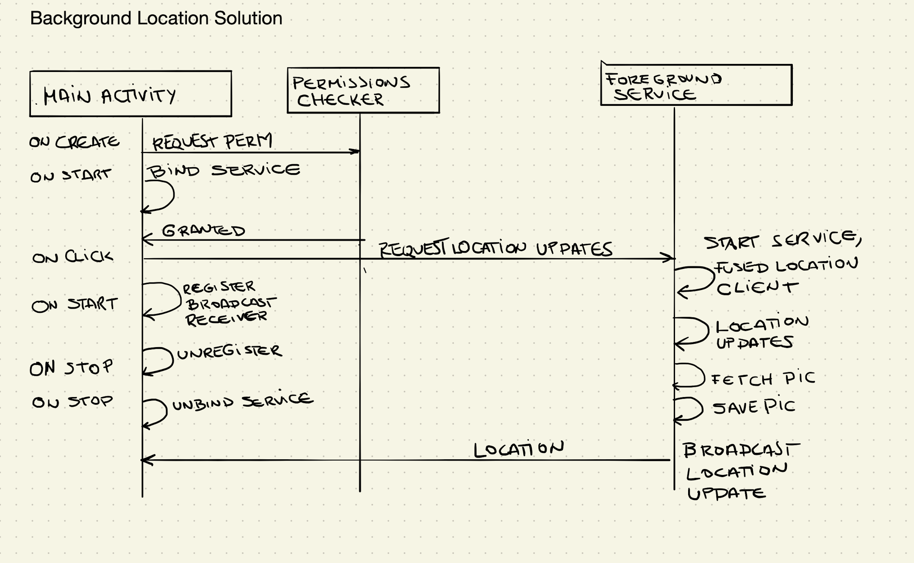
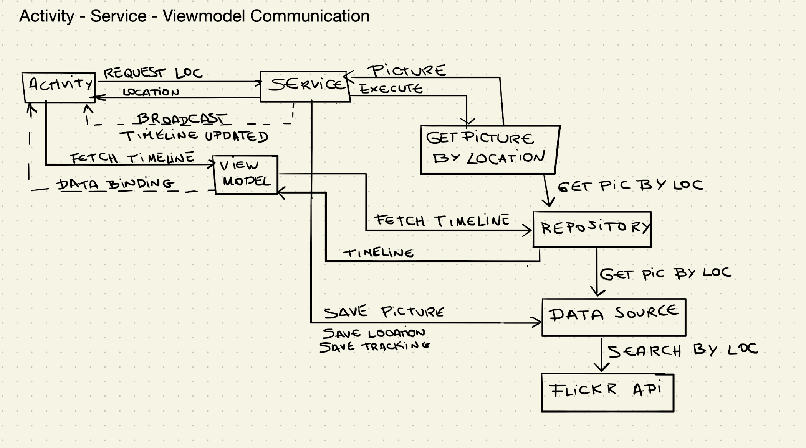

# picture-timeline-android
This repo represents a basic app that keeps track of the user location while they walk.
Every time there is a location update, it fetches a picture corresponding to that location
using using flickr search api.
While walking or at the end of the walk, the user can scroll through a timeline of pictures
to see the locations they have passed by.

## Purpose
The purpose of this implementation is to play around with the following concepts:
- Creating a foreground service https://developer.android.com/training/run-background-service/create-service
- Receiving periodic location updates https://developer.android.com/training/location/request-updates

## UI
| The app in the fore ground | The app in the background      |
| -------------------------- | ------------------------------ |
|     |   |

## Architecture and Implementation approach
I've decided to go for the presentation pattern `MVVM` and a light version of `Clean Architecture` to decouple layers and keep the app easy to scale.

The viewModel mainly presents the current state of the app stored in the repository.

The background service checks for location updates, then fetches the pictures from the flickr api and store the current state locally.
The state is compose of 3 objects:
- isTracking = true/false
- location = current location
- savedImages = list of image Urls fetched from flickr api during the session/walk

Due to simplicity, I save the state of the app in the shared preferences to allow quick access.

### Interaction between the MainActivity and the LocationUpdatesService.

### Flow between the main components of the app.

The ViewModel has been implemented using `LiveData` and `Data Binding`.

--
If you would like to see a sample implementation with `MVP + CleanArch + Dagger2 + Feature modules`, feel free to go to this repo https://github.com/claucookie/android_lastfm_kotlin
--
## Tools

- Kotlin : https://kotlinlang.org/
- Android Jetpack Components : https://developer.android.com/jetpack
- Glide : https://github.com/bumptech/glide
- Retrofit 2 : https://github.com/square/retrofit
- Detekt : https://github.com/arturbosch/detekt
- Koin : https://github.com/InsertKoinIO/koin
- Location Services: https://developer.android.com/training/location

## Testing

No tests for now, they were not part of the exercise.